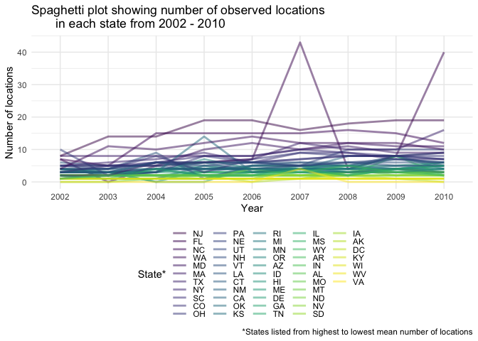

PUBH 7462 Homework 3
================
Kristin Elgersma
2/10/22

## Problem 3. BRFSS SMART 2002-2010

``` r
# Read data
brfss <- read_csv("./data/brfss_smart_2010.csv")
```

### 3.1 Data Exploration & Cleaning

``` r
# clean variable names
brfss <- janitor::clean_names(brfss)

# clean data
brfss.clean <- brfss %>%
  filter(topic == "Overall Health") %>% # select overall health topic
  separate(locationdesc, c(NA, "county")) %>% # create county variable
  mutate(locationabbr = factor(locationabbr), 
         state = fct_recode(locationabbr)) %>% # rename locationabbr to state
  dplyr::select(year, state, county, response, sample_size, data_value) # retain desired columns

# Make other categorical variables factors
brfss.clean$year <- as.factor(brfss.clean$year)
brfss.clean$county <- as.factor(brfss.clean$county)
brfss.clean$response <- as.factor(brfss.clean$response)
```

### 3.2 Data Description

1.  **Number of observations:** 10625
2.  **Number of variables:** 6
3.  **Definition of a case:** Each case represents a group of
    individuals from a county who provided the same answer to an overall
    health question in the same year.
4.  **Variable names and definitions**:

-   year: Year of observation
-   state: State of observation
-   county: County of observation
-   response: Response to question: “How is your general health?” Answer
    choices include “Excellent,” Very good,” Good,” “Fair,” and “Poor”
-   sample_size: Number of individuals that chose the given response
    option
-   data_value: Proportion of individuals those chose the given response
    option in a given county, in a given year.

### 3.3 Data Science

#### 3.3.1 In the year 2004, which states were observed at 6 locations?

``` r
df <- brfss.clean %>%
  filter(year == "2004") %>% # choose only 2004 observations
  group_by(state) %>%
  distinct(county) %>% # list the counties in which observations occurred
  summarise(no_rows = length(state)) %>% # count locations in each state
  filter(no_rows == 6) # select only those with 6 locations

 gt(df) %>%
   tab_header("States observed at 6 locations in 2004") %>%
   cols_label(state = " ") %>%
   cols_hide(no_rows)
```

<div id="gbcfbdgpqw" style="overflow-x:auto;overflow-y:auto;width:auto;height:auto;">
<style>html {
  font-family: -apple-system, BlinkMacSystemFont, 'Segoe UI', Roboto, Oxygen, Ubuntu, Cantarell, 'Helvetica Neue', 'Fira Sans', 'Droid Sans', Arial, sans-serif;
}

#gbcfbdgpqw .gt_table {
  display: table;
  border-collapse: collapse;
  margin-left: auto;
  margin-right: auto;
  color: #333333;
  font-size: 16px;
  font-weight: normal;
  font-style: normal;
  background-color: #FFFFFF;
  width: auto;
  border-top-style: solid;
  border-top-width: 2px;
  border-top-color: #A8A8A8;
  border-right-style: none;
  border-right-width: 2px;
  border-right-color: #D3D3D3;
  border-bottom-style: solid;
  border-bottom-width: 2px;
  border-bottom-color: #A8A8A8;
  border-left-style: none;
  border-left-width: 2px;
  border-left-color: #D3D3D3;
}

#gbcfbdgpqw .gt_heading {
  background-color: #FFFFFF;
  text-align: center;
  border-bottom-color: #FFFFFF;
  border-left-style: none;
  border-left-width: 1px;
  border-left-color: #D3D3D3;
  border-right-style: none;
  border-right-width: 1px;
  border-right-color: #D3D3D3;
}

#gbcfbdgpqw .gt_title {
  color: #333333;
  font-size: 125%;
  font-weight: initial;
  padding-top: 4px;
  padding-bottom: 4px;
  border-bottom-color: #FFFFFF;
  border-bottom-width: 0;
}

#gbcfbdgpqw .gt_subtitle {
  color: #333333;
  font-size: 85%;
  font-weight: initial;
  padding-top: 0;
  padding-bottom: 6px;
  border-top-color: #FFFFFF;
  border-top-width: 0;
}

#gbcfbdgpqw .gt_bottom_border {
  border-bottom-style: solid;
  border-bottom-width: 2px;
  border-bottom-color: #D3D3D3;
}

#gbcfbdgpqw .gt_col_headings {
  border-top-style: solid;
  border-top-width: 2px;
  border-top-color: #D3D3D3;
  border-bottom-style: solid;
  border-bottom-width: 2px;
  border-bottom-color: #D3D3D3;
  border-left-style: none;
  border-left-width: 1px;
  border-left-color: #D3D3D3;
  border-right-style: none;
  border-right-width: 1px;
  border-right-color: #D3D3D3;
}

#gbcfbdgpqw .gt_col_heading {
  color: #333333;
  background-color: #FFFFFF;
  font-size: 100%;
  font-weight: normal;
  text-transform: inherit;
  border-left-style: none;
  border-left-width: 1px;
  border-left-color: #D3D3D3;
  border-right-style: none;
  border-right-width: 1px;
  border-right-color: #D3D3D3;
  vertical-align: bottom;
  padding-top: 5px;
  padding-bottom: 6px;
  padding-left: 5px;
  padding-right: 5px;
  overflow-x: hidden;
}

#gbcfbdgpqw .gt_column_spanner_outer {
  color: #333333;
  background-color: #FFFFFF;
  font-size: 100%;
  font-weight: normal;
  text-transform: inherit;
  padding-top: 0;
  padding-bottom: 0;
  padding-left: 4px;
  padding-right: 4px;
}

#gbcfbdgpqw .gt_column_spanner_outer:first-child {
  padding-left: 0;
}

#gbcfbdgpqw .gt_column_spanner_outer:last-child {
  padding-right: 0;
}

#gbcfbdgpqw .gt_column_spanner {
  border-bottom-style: solid;
  border-bottom-width: 2px;
  border-bottom-color: #D3D3D3;
  vertical-align: bottom;
  padding-top: 5px;
  padding-bottom: 5px;
  overflow-x: hidden;
  display: inline-block;
  width: 100%;
}

#gbcfbdgpqw .gt_group_heading {
  padding: 8px;
  color: #333333;
  background-color: #FFFFFF;
  font-size: 100%;
  font-weight: initial;
  text-transform: inherit;
  border-top-style: solid;
  border-top-width: 2px;
  border-top-color: #D3D3D3;
  border-bottom-style: solid;
  border-bottom-width: 2px;
  border-bottom-color: #D3D3D3;
  border-left-style: none;
  border-left-width: 1px;
  border-left-color: #D3D3D3;
  border-right-style: none;
  border-right-width: 1px;
  border-right-color: #D3D3D3;
  vertical-align: middle;
}

#gbcfbdgpqw .gt_empty_group_heading {
  padding: 0.5px;
  color: #333333;
  background-color: #FFFFFF;
  font-size: 100%;
  font-weight: initial;
  border-top-style: solid;
  border-top-width: 2px;
  border-top-color: #D3D3D3;
  border-bottom-style: solid;
  border-bottom-width: 2px;
  border-bottom-color: #D3D3D3;
  vertical-align: middle;
}

#gbcfbdgpqw .gt_from_md > :first-child {
  margin-top: 0;
}

#gbcfbdgpqw .gt_from_md > :last-child {
  margin-bottom: 0;
}

#gbcfbdgpqw .gt_row {
  padding-top: 8px;
  padding-bottom: 8px;
  padding-left: 5px;
  padding-right: 5px;
  margin: 10px;
  border-top-style: solid;
  border-top-width: 1px;
  border-top-color: #D3D3D3;
  border-left-style: none;
  border-left-width: 1px;
  border-left-color: #D3D3D3;
  border-right-style: none;
  border-right-width: 1px;
  border-right-color: #D3D3D3;
  vertical-align: middle;
  overflow-x: hidden;
}

#gbcfbdgpqw .gt_stub {
  color: #333333;
  background-color: #FFFFFF;
  font-size: 100%;
  font-weight: initial;
  text-transform: inherit;
  border-right-style: solid;
  border-right-width: 2px;
  border-right-color: #D3D3D3;
  padding-left: 12px;
}

#gbcfbdgpqw .gt_summary_row {
  color: #333333;
  background-color: #FFFFFF;
  text-transform: inherit;
  padding-top: 8px;
  padding-bottom: 8px;
  padding-left: 5px;
  padding-right: 5px;
}

#gbcfbdgpqw .gt_first_summary_row {
  padding-top: 8px;
  padding-bottom: 8px;
  padding-left: 5px;
  padding-right: 5px;
  border-top-style: solid;
  border-top-width: 2px;
  border-top-color: #D3D3D3;
}

#gbcfbdgpqw .gt_grand_summary_row {
  color: #333333;
  background-color: #FFFFFF;
  text-transform: inherit;
  padding-top: 8px;
  padding-bottom: 8px;
  padding-left: 5px;
  padding-right: 5px;
}

#gbcfbdgpqw .gt_first_grand_summary_row {
  padding-top: 8px;
  padding-bottom: 8px;
  padding-left: 5px;
  padding-right: 5px;
  border-top-style: double;
  border-top-width: 6px;
  border-top-color: #D3D3D3;
}

#gbcfbdgpqw .gt_striped {
  background-color: rgba(128, 128, 128, 0.05);
}

#gbcfbdgpqw .gt_table_body {
  border-top-style: solid;
  border-top-width: 2px;
  border-top-color: #D3D3D3;
  border-bottom-style: solid;
  border-bottom-width: 2px;
  border-bottom-color: #D3D3D3;
}

#gbcfbdgpqw .gt_footnotes {
  color: #333333;
  background-color: #FFFFFF;
  border-bottom-style: none;
  border-bottom-width: 2px;
  border-bottom-color: #D3D3D3;
  border-left-style: none;
  border-left-width: 2px;
  border-left-color: #D3D3D3;
  border-right-style: none;
  border-right-width: 2px;
  border-right-color: #D3D3D3;
}

#gbcfbdgpqw .gt_footnote {
  margin: 0px;
  font-size: 90%;
  padding: 4px;
}

#gbcfbdgpqw .gt_sourcenotes {
  color: #333333;
  background-color: #FFFFFF;
  border-bottom-style: none;
  border-bottom-width: 2px;
  border-bottom-color: #D3D3D3;
  border-left-style: none;
  border-left-width: 2px;
  border-left-color: #D3D3D3;
  border-right-style: none;
  border-right-width: 2px;
  border-right-color: #D3D3D3;
}

#gbcfbdgpqw .gt_sourcenote {
  font-size: 90%;
  padding: 4px;
}

#gbcfbdgpqw .gt_left {
  text-align: left;
}

#gbcfbdgpqw .gt_center {
  text-align: center;
}

#gbcfbdgpqw .gt_right {
  text-align: right;
  font-variant-numeric: tabular-nums;
}

#gbcfbdgpqw .gt_font_normal {
  font-weight: normal;
}

#gbcfbdgpqw .gt_font_bold {
  font-weight: bold;
}

#gbcfbdgpqw .gt_font_italic {
  font-style: italic;
}

#gbcfbdgpqw .gt_super {
  font-size: 65%;
}

#gbcfbdgpqw .gt_footnote_marks {
  font-style: italic;
  font-weight: normal;
  font-size: 65%;
}
</style>
<table class="gt_table">
  <thead class="gt_header">
    <tr>
      <th colspan="1" class="gt_heading gt_title gt_font_normal gt_bottom_border" style>States observed at 6 locations in 2004</th>
    </tr>
    
  </thead>
  <thead class="gt_col_headings">
    <tr>
      <th class="gt_col_heading gt_columns_bottom_border gt_center" rowspan="1" colspan="1"> </th>
    </tr>
  </thead>
  <tbody class="gt_table_body">
    <tr><td class="gt_row gt_center">CO</td></tr>
    <tr><td class="gt_row gt_center">NM</td></tr>
    <tr><td class="gt_row gt_center">SC</td></tr>
    <tr><td class="gt_row gt_center">TX</td></tr>
    <tr><td class="gt_row gt_center">UT</td></tr>
    <tr><td class="gt_row gt_center">VT</td></tr>
  </tbody>
  
  
</table>
</div>

#### 3.3.2 Make a “spaghetti plot” that shows the number of observed locations in each state from 2002 to 2010.

``` r
df <- brfss.clean %>%
  group_by(year, state) %>%
  distinct(county) %>% # list the counties in which observations occurred
  summarise(no_rows = length(state)) %>% # count locations in each state
  complete(state) # make sure that no states are completely missing a year

# change nas for states with no observation that year to 0 for better plotting and summary statistics
df$no_rows[is.na(df$no_rows)] <- 0 

# create a column with mean # of locations by state for plotting
df <- df %>%
  group_by(state) %>%
  mutate(mean_loc = mean(no_rows))

#spaghetti plot
df %>%
  ggplot(aes(year, no_rows)) +
  geom_line(aes(group = state, color = fct_reorder(state, mean_loc, .desc = TRUE)), # order states from highest to lowest mean # of locations
            size = 1, alpha = 0.5) +
  theme_minimal() +
  labs(
    x = "Year",
    y = "Number of locations",
    title = "Spaghetti plot showing number of observed locations 
       in each state from 2002 - 2010",
    caption = "*States listed from highest to lowest mean number of locations"
  ) +
  scale_color_viridis_d(name = "State*") + 
  theme(legend.position = "bottom",
        legend.key.height = unit(0.3, 'cm'))
```



Which state has the highest mean number of locations over this period?

``` r
df2 <- df %>%
  group_by(state) %>%
  summarise(mean = mean(no_rows)) %>% # get mean number of locations by state
  slice_max(mean, n = 1) # select the location with the highest mean

#create the table showing the highest mean number of locations
gt(df2) %>%
  fmt_number(
    columns = mean,
    decimals = 2  # only 2 decimal points
  ) %>%
  tab_header("State with the highest mean number of locations
             from 2002 - 2010") %>%
  cols_label(
    state = "State",
    mean = "Mean number of locations"
  )
```

<div id="xmjxqybmwo" style="overflow-x:auto;overflow-y:auto;width:auto;height:auto;">
<style>html {
  font-family: -apple-system, BlinkMacSystemFont, 'Segoe UI', Roboto, Oxygen, Ubuntu, Cantarell, 'Helvetica Neue', 'Fira Sans', 'Droid Sans', Arial, sans-serif;
}

#xmjxqybmwo .gt_table {
  display: table;
  border-collapse: collapse;
  margin-left: auto;
  margin-right: auto;
  color: #333333;
  font-size: 16px;
  font-weight: normal;
  font-style: normal;
  background-color: #FFFFFF;
  width: auto;
  border-top-style: solid;
  border-top-width: 2px;
  border-top-color: #A8A8A8;
  border-right-style: none;
  border-right-width: 2px;
  border-right-color: #D3D3D3;
  border-bottom-style: solid;
  border-bottom-width: 2px;
  border-bottom-color: #A8A8A8;
  border-left-style: none;
  border-left-width: 2px;
  border-left-color: #D3D3D3;
}

#xmjxqybmwo .gt_heading {
  background-color: #FFFFFF;
  text-align: center;
  border-bottom-color: #FFFFFF;
  border-left-style: none;
  border-left-width: 1px;
  border-left-color: #D3D3D3;
  border-right-style: none;
  border-right-width: 1px;
  border-right-color: #D3D3D3;
}

#xmjxqybmwo .gt_title {
  color: #333333;
  font-size: 125%;
  font-weight: initial;
  padding-top: 4px;
  padding-bottom: 4px;
  border-bottom-color: #FFFFFF;
  border-bottom-width: 0;
}

#xmjxqybmwo .gt_subtitle {
  color: #333333;
  font-size: 85%;
  font-weight: initial;
  padding-top: 0;
  padding-bottom: 6px;
  border-top-color: #FFFFFF;
  border-top-width: 0;
}

#xmjxqybmwo .gt_bottom_border {
  border-bottom-style: solid;
  border-bottom-width: 2px;
  border-bottom-color: #D3D3D3;
}

#xmjxqybmwo .gt_col_headings {
  border-top-style: solid;
  border-top-width: 2px;
  border-top-color: #D3D3D3;
  border-bottom-style: solid;
  border-bottom-width: 2px;
  border-bottom-color: #D3D3D3;
  border-left-style: none;
  border-left-width: 1px;
  border-left-color: #D3D3D3;
  border-right-style: none;
  border-right-width: 1px;
  border-right-color: #D3D3D3;
}

#xmjxqybmwo .gt_col_heading {
  color: #333333;
  background-color: #FFFFFF;
  font-size: 100%;
  font-weight: normal;
  text-transform: inherit;
  border-left-style: none;
  border-left-width: 1px;
  border-left-color: #D3D3D3;
  border-right-style: none;
  border-right-width: 1px;
  border-right-color: #D3D3D3;
  vertical-align: bottom;
  padding-top: 5px;
  padding-bottom: 6px;
  padding-left: 5px;
  padding-right: 5px;
  overflow-x: hidden;
}

#xmjxqybmwo .gt_column_spanner_outer {
  color: #333333;
  background-color: #FFFFFF;
  font-size: 100%;
  font-weight: normal;
  text-transform: inherit;
  padding-top: 0;
  padding-bottom: 0;
  padding-left: 4px;
  padding-right: 4px;
}

#xmjxqybmwo .gt_column_spanner_outer:first-child {
  padding-left: 0;
}

#xmjxqybmwo .gt_column_spanner_outer:last-child {
  padding-right: 0;
}

#xmjxqybmwo .gt_column_spanner {
  border-bottom-style: solid;
  border-bottom-width: 2px;
  border-bottom-color: #D3D3D3;
  vertical-align: bottom;
  padding-top: 5px;
  padding-bottom: 5px;
  overflow-x: hidden;
  display: inline-block;
  width: 100%;
}

#xmjxqybmwo .gt_group_heading {
  padding: 8px;
  color: #333333;
  background-color: #FFFFFF;
  font-size: 100%;
  font-weight: initial;
  text-transform: inherit;
  border-top-style: solid;
  border-top-width: 2px;
  border-top-color: #D3D3D3;
  border-bottom-style: solid;
  border-bottom-width: 2px;
  border-bottom-color: #D3D3D3;
  border-left-style: none;
  border-left-width: 1px;
  border-left-color: #D3D3D3;
  border-right-style: none;
  border-right-width: 1px;
  border-right-color: #D3D3D3;
  vertical-align: middle;
}

#xmjxqybmwo .gt_empty_group_heading {
  padding: 0.5px;
  color: #333333;
  background-color: #FFFFFF;
  font-size: 100%;
  font-weight: initial;
  border-top-style: solid;
  border-top-width: 2px;
  border-top-color: #D3D3D3;
  border-bottom-style: solid;
  border-bottom-width: 2px;
  border-bottom-color: #D3D3D3;
  vertical-align: middle;
}

#xmjxqybmwo .gt_from_md > :first-child {
  margin-top: 0;
}

#xmjxqybmwo .gt_from_md > :last-child {
  margin-bottom: 0;
}

#xmjxqybmwo .gt_row {
  padding-top: 8px;
  padding-bottom: 8px;
  padding-left: 5px;
  padding-right: 5px;
  margin: 10px;
  border-top-style: solid;
  border-top-width: 1px;
  border-top-color: #D3D3D3;
  border-left-style: none;
  border-left-width: 1px;
  border-left-color: #D3D3D3;
  border-right-style: none;
  border-right-width: 1px;
  border-right-color: #D3D3D3;
  vertical-align: middle;
  overflow-x: hidden;
}

#xmjxqybmwo .gt_stub {
  color: #333333;
  background-color: #FFFFFF;
  font-size: 100%;
  font-weight: initial;
  text-transform: inherit;
  border-right-style: solid;
  border-right-width: 2px;
  border-right-color: #D3D3D3;
  padding-left: 12px;
}

#xmjxqybmwo .gt_summary_row {
  color: #333333;
  background-color: #FFFFFF;
  text-transform: inherit;
  padding-top: 8px;
  padding-bottom: 8px;
  padding-left: 5px;
  padding-right: 5px;
}

#xmjxqybmwo .gt_first_summary_row {
  padding-top: 8px;
  padding-bottom: 8px;
  padding-left: 5px;
  padding-right: 5px;
  border-top-style: solid;
  border-top-width: 2px;
  border-top-color: #D3D3D3;
}

#xmjxqybmwo .gt_grand_summary_row {
  color: #333333;
  background-color: #FFFFFF;
  text-transform: inherit;
  padding-top: 8px;
  padding-bottom: 8px;
  padding-left: 5px;
  padding-right: 5px;
}

#xmjxqybmwo .gt_first_grand_summary_row {
  padding-top: 8px;
  padding-bottom: 8px;
  padding-left: 5px;
  padding-right: 5px;
  border-top-style: double;
  border-top-width: 6px;
  border-top-color: #D3D3D3;
}

#xmjxqybmwo .gt_striped {
  background-color: rgba(128, 128, 128, 0.05);
}

#xmjxqybmwo .gt_table_body {
  border-top-style: solid;
  border-top-width: 2px;
  border-top-color: #D3D3D3;
  border-bottom-style: solid;
  border-bottom-width: 2px;
  border-bottom-color: #D3D3D3;
}

#xmjxqybmwo .gt_footnotes {
  color: #333333;
  background-color: #FFFFFF;
  border-bottom-style: none;
  border-bottom-width: 2px;
  border-bottom-color: #D3D3D3;
  border-left-style: none;
  border-left-width: 2px;
  border-left-color: #D3D3D3;
  border-right-style: none;
  border-right-width: 2px;
  border-right-color: #D3D3D3;
}

#xmjxqybmwo .gt_footnote {
  margin: 0px;
  font-size: 90%;
  padding: 4px;
}

#xmjxqybmwo .gt_sourcenotes {
  color: #333333;
  background-color: #FFFFFF;
  border-bottom-style: none;
  border-bottom-width: 2px;
  border-bottom-color: #D3D3D3;
  border-left-style: none;
  border-left-width: 2px;
  border-left-color: #D3D3D3;
  border-right-style: none;
  border-right-width: 2px;
  border-right-color: #D3D3D3;
}

#xmjxqybmwo .gt_sourcenote {
  font-size: 90%;
  padding: 4px;
}

#xmjxqybmwo .gt_left {
  text-align: left;
}

#xmjxqybmwo .gt_center {
  text-align: center;
}

#xmjxqybmwo .gt_right {
  text-align: right;
  font-variant-numeric: tabular-nums;
}

#xmjxqybmwo .gt_font_normal {
  font-weight: normal;
}

#xmjxqybmwo .gt_font_bold {
  font-weight: bold;
}

#xmjxqybmwo .gt_font_italic {
  font-style: italic;
}

#xmjxqybmwo .gt_super {
  font-size: 65%;
}

#xmjxqybmwo .gt_footnote_marks {
  font-style: italic;
  font-weight: normal;
  font-size: 65%;
}
</style>
<table class="gt_table">
  <thead class="gt_header">
    <tr>
      <th colspan="2" class="gt_heading gt_title gt_font_normal gt_bottom_border" style>State with the highest mean number of locations
             from 2002 - 2010</th>
    </tr>
    
  </thead>
  <thead class="gt_col_headings">
    <tr>
      <th class="gt_col_heading gt_columns_bottom_border gt_center" rowspan="1" colspan="1">State</th>
      <th class="gt_col_heading gt_columns_bottom_border gt_right" rowspan="1" colspan="1">Mean number of locations</th>
    </tr>
  </thead>
  <tbody class="gt_table_body">
    <tr><td class="gt_row gt_center">NJ</td>
<td class="gt_row gt_right">16.22</td></tr>
  </tbody>
  
  
</table>
</div>

#### 3.3.3 Make a table showing, for the years 2002, 2006, and 2010, the mean and standard deviation of sample size and proportion of Excellent, Good, and Poor responses across locations in MN.

``` r
df <- brfss.clean %>%
  filter(year == "2002" | year == "2006" | year == "2010") %>%
  filter(state == "MN") %>%
  filter(response == "Excellent" | response == "Good" | response == "Poor") %>%
  group_by(year, response) %>%
  summarise(
    across(
      contains(c("sample_size", "data_value")),
      list(mean = mean, sd = sd), na.rm = TRUE,
      .names = "{.col}_{.fn}"
    )) %>%
  ungroup() %>%
  group_by(year)

# Create table
df %>%
  gt() %>%
    fmt_number(
    columns = c(3:6),
    decimals = 2 # only 2 decimals
  ) %>%
  tab_header("Mean and standard deviation of sample size and proportion of respondents whose health was excellent, good, or poor in Minnesota in 2002, 2006, and 2010") %>%
  cols_label(
    response = " ",
    sample_size_mean = "Sample size mean",
    sample_size_sd = "Sample size SD",
    data_value_mean = "Proportion mean",
    data_value_sd = "Proportion SD"
  )
```

<div id="gfaetuadhv" style="overflow-x:auto;overflow-y:auto;width:auto;height:auto;">
<style>html {
  font-family: -apple-system, BlinkMacSystemFont, 'Segoe UI', Roboto, Oxygen, Ubuntu, Cantarell, 'Helvetica Neue', 'Fira Sans', 'Droid Sans', Arial, sans-serif;
}

#gfaetuadhv .gt_table {
  display: table;
  border-collapse: collapse;
  margin-left: auto;
  margin-right: auto;
  color: #333333;
  font-size: 16px;
  font-weight: normal;
  font-style: normal;
  background-color: #FFFFFF;
  width: auto;
  border-top-style: solid;
  border-top-width: 2px;
  border-top-color: #A8A8A8;
  border-right-style: none;
  border-right-width: 2px;
  border-right-color: #D3D3D3;
  border-bottom-style: solid;
  border-bottom-width: 2px;
  border-bottom-color: #A8A8A8;
  border-left-style: none;
  border-left-width: 2px;
  border-left-color: #D3D3D3;
}

#gfaetuadhv .gt_heading {
  background-color: #FFFFFF;
  text-align: center;
  border-bottom-color: #FFFFFF;
  border-left-style: none;
  border-left-width: 1px;
  border-left-color: #D3D3D3;
  border-right-style: none;
  border-right-width: 1px;
  border-right-color: #D3D3D3;
}

#gfaetuadhv .gt_title {
  color: #333333;
  font-size: 125%;
  font-weight: initial;
  padding-top: 4px;
  padding-bottom: 4px;
  border-bottom-color: #FFFFFF;
  border-bottom-width: 0;
}

#gfaetuadhv .gt_subtitle {
  color: #333333;
  font-size: 85%;
  font-weight: initial;
  padding-top: 0;
  padding-bottom: 6px;
  border-top-color: #FFFFFF;
  border-top-width: 0;
}

#gfaetuadhv .gt_bottom_border {
  border-bottom-style: solid;
  border-bottom-width: 2px;
  border-bottom-color: #D3D3D3;
}

#gfaetuadhv .gt_col_headings {
  border-top-style: solid;
  border-top-width: 2px;
  border-top-color: #D3D3D3;
  border-bottom-style: solid;
  border-bottom-width: 2px;
  border-bottom-color: #D3D3D3;
  border-left-style: none;
  border-left-width: 1px;
  border-left-color: #D3D3D3;
  border-right-style: none;
  border-right-width: 1px;
  border-right-color: #D3D3D3;
}

#gfaetuadhv .gt_col_heading {
  color: #333333;
  background-color: #FFFFFF;
  font-size: 100%;
  font-weight: normal;
  text-transform: inherit;
  border-left-style: none;
  border-left-width: 1px;
  border-left-color: #D3D3D3;
  border-right-style: none;
  border-right-width: 1px;
  border-right-color: #D3D3D3;
  vertical-align: bottom;
  padding-top: 5px;
  padding-bottom: 6px;
  padding-left: 5px;
  padding-right: 5px;
  overflow-x: hidden;
}

#gfaetuadhv .gt_column_spanner_outer {
  color: #333333;
  background-color: #FFFFFF;
  font-size: 100%;
  font-weight: normal;
  text-transform: inherit;
  padding-top: 0;
  padding-bottom: 0;
  padding-left: 4px;
  padding-right: 4px;
}

#gfaetuadhv .gt_column_spanner_outer:first-child {
  padding-left: 0;
}

#gfaetuadhv .gt_column_spanner_outer:last-child {
  padding-right: 0;
}

#gfaetuadhv .gt_column_spanner {
  border-bottom-style: solid;
  border-bottom-width: 2px;
  border-bottom-color: #D3D3D3;
  vertical-align: bottom;
  padding-top: 5px;
  padding-bottom: 5px;
  overflow-x: hidden;
  display: inline-block;
  width: 100%;
}

#gfaetuadhv .gt_group_heading {
  padding: 8px;
  color: #333333;
  background-color: #FFFFFF;
  font-size: 100%;
  font-weight: initial;
  text-transform: inherit;
  border-top-style: solid;
  border-top-width: 2px;
  border-top-color: #D3D3D3;
  border-bottom-style: solid;
  border-bottom-width: 2px;
  border-bottom-color: #D3D3D3;
  border-left-style: none;
  border-left-width: 1px;
  border-left-color: #D3D3D3;
  border-right-style: none;
  border-right-width: 1px;
  border-right-color: #D3D3D3;
  vertical-align: middle;
}

#gfaetuadhv .gt_empty_group_heading {
  padding: 0.5px;
  color: #333333;
  background-color: #FFFFFF;
  font-size: 100%;
  font-weight: initial;
  border-top-style: solid;
  border-top-width: 2px;
  border-top-color: #D3D3D3;
  border-bottom-style: solid;
  border-bottom-width: 2px;
  border-bottom-color: #D3D3D3;
  vertical-align: middle;
}

#gfaetuadhv .gt_from_md > :first-child {
  margin-top: 0;
}

#gfaetuadhv .gt_from_md > :last-child {
  margin-bottom: 0;
}

#gfaetuadhv .gt_row {
  padding-top: 8px;
  padding-bottom: 8px;
  padding-left: 5px;
  padding-right: 5px;
  margin: 10px;
  border-top-style: solid;
  border-top-width: 1px;
  border-top-color: #D3D3D3;
  border-left-style: none;
  border-left-width: 1px;
  border-left-color: #D3D3D3;
  border-right-style: none;
  border-right-width: 1px;
  border-right-color: #D3D3D3;
  vertical-align: middle;
  overflow-x: hidden;
}

#gfaetuadhv .gt_stub {
  color: #333333;
  background-color: #FFFFFF;
  font-size: 100%;
  font-weight: initial;
  text-transform: inherit;
  border-right-style: solid;
  border-right-width: 2px;
  border-right-color: #D3D3D3;
  padding-left: 12px;
}

#gfaetuadhv .gt_summary_row {
  color: #333333;
  background-color: #FFFFFF;
  text-transform: inherit;
  padding-top: 8px;
  padding-bottom: 8px;
  padding-left: 5px;
  padding-right: 5px;
}

#gfaetuadhv .gt_first_summary_row {
  padding-top: 8px;
  padding-bottom: 8px;
  padding-left: 5px;
  padding-right: 5px;
  border-top-style: solid;
  border-top-width: 2px;
  border-top-color: #D3D3D3;
}

#gfaetuadhv .gt_grand_summary_row {
  color: #333333;
  background-color: #FFFFFF;
  text-transform: inherit;
  padding-top: 8px;
  padding-bottom: 8px;
  padding-left: 5px;
  padding-right: 5px;
}

#gfaetuadhv .gt_first_grand_summary_row {
  padding-top: 8px;
  padding-bottom: 8px;
  padding-left: 5px;
  padding-right: 5px;
  border-top-style: double;
  border-top-width: 6px;
  border-top-color: #D3D3D3;
}

#gfaetuadhv .gt_striped {
  background-color: rgba(128, 128, 128, 0.05);
}

#gfaetuadhv .gt_table_body {
  border-top-style: solid;
  border-top-width: 2px;
  border-top-color: #D3D3D3;
  border-bottom-style: solid;
  border-bottom-width: 2px;
  border-bottom-color: #D3D3D3;
}

#gfaetuadhv .gt_footnotes {
  color: #333333;
  background-color: #FFFFFF;
  border-bottom-style: none;
  border-bottom-width: 2px;
  border-bottom-color: #D3D3D3;
  border-left-style: none;
  border-left-width: 2px;
  border-left-color: #D3D3D3;
  border-right-style: none;
  border-right-width: 2px;
  border-right-color: #D3D3D3;
}

#gfaetuadhv .gt_footnote {
  margin: 0px;
  font-size: 90%;
  padding: 4px;
}

#gfaetuadhv .gt_sourcenotes {
  color: #333333;
  background-color: #FFFFFF;
  border-bottom-style: none;
  border-bottom-width: 2px;
  border-bottom-color: #D3D3D3;
  border-left-style: none;
  border-left-width: 2px;
  border-left-color: #D3D3D3;
  border-right-style: none;
  border-right-width: 2px;
  border-right-color: #D3D3D3;
}

#gfaetuadhv .gt_sourcenote {
  font-size: 90%;
  padding: 4px;
}

#gfaetuadhv .gt_left {
  text-align: left;
}

#gfaetuadhv .gt_center {
  text-align: center;
}

#gfaetuadhv .gt_right {
  text-align: right;
  font-variant-numeric: tabular-nums;
}

#gfaetuadhv .gt_font_normal {
  font-weight: normal;
}

#gfaetuadhv .gt_font_bold {
  font-weight: bold;
}

#gfaetuadhv .gt_font_italic {
  font-style: italic;
}

#gfaetuadhv .gt_super {
  font-size: 65%;
}

#gfaetuadhv .gt_footnote_marks {
  font-style: italic;
  font-weight: normal;
  font-size: 65%;
}
</style>
<table class="gt_table">
  <thead class="gt_header">
    <tr>
      <th colspan="5" class="gt_heading gt_title gt_font_normal gt_bottom_border" style>Mean and standard deviation of sample size and proportion of respondents whose health was excellent, good, or poor in Minnesota in 2002, 2006, and 2010</th>
    </tr>
    
  </thead>
  <thead class="gt_col_headings">
    <tr>
      <th class="gt_col_heading gt_columns_bottom_border gt_center" rowspan="1" colspan="1"> </th>
      <th class="gt_col_heading gt_columns_bottom_border gt_right" rowspan="1" colspan="1">Sample size mean</th>
      <th class="gt_col_heading gt_columns_bottom_border gt_right" rowspan="1" colspan="1">Sample size SD</th>
      <th class="gt_col_heading gt_columns_bottom_border gt_right" rowspan="1" colspan="1">Proportion mean</th>
      <th class="gt_col_heading gt_columns_bottom_border gt_right" rowspan="1" colspan="1">Proportion SD</th>
    </tr>
  </thead>
  <tbody class="gt_table_body">
    <tr class="gt_group_heading_row">
      <td colspan="5" class="gt_group_heading">2002</td>
    </tr>
    <tr><td class="gt_row gt_center">Excellent</td>
<td class="gt_row gt_right">116.00</td>
<td class="gt_row gt_right">83.27</td>
<td class="gt_row gt_right">24.15</td>
<td class="gt_row gt_right">3.54</td></tr>
    <tr><td class="gt_row gt_center">Good</td>
<td class="gt_row gt_right">123.75</td>
<td class="gt_row gt_right">84.26</td>
<td class="gt_row gt_right">23.95</td>
<td class="gt_row gt_right">1.05</td></tr>
    <tr><td class="gt_row gt_center">Poor</td>
<td class="gt_row gt_right">13.75</td>
<td class="gt_row gt_right">9.57</td>
<td class="gt_row gt_right">2.40</td>
<td class="gt_row gt_right">1.17</td></tr>
    <tr class="gt_group_heading_row">
      <td colspan="5" class="gt_group_heading">2006</td>
    </tr>
    <tr><td class="gt_row gt_center">Excellent</td>
<td class="gt_row gt_right">122.33</td>
<td class="gt_row gt_right">72.62</td>
<td class="gt_row gt_right">23.83</td>
<td class="gt_row gt_right">2.99</td></tr>
    <tr><td class="gt_row gt_center">Good</td>
<td class="gt_row gt_right">137.33</td>
<td class="gt_row gt_right">85.82</td>
<td class="gt_row gt_right">26.37</td>
<td class="gt_row gt_right">0.45</td></tr>
    <tr><td class="gt_row gt_center">Poor</td>
<td class="gt_row gt_right">15.00</td>
<td class="gt_row gt_right">6.93</td>
<td class="gt_row gt_right">2.30</td>
<td class="gt_row gt_right">0.95</td></tr>
    <tr class="gt_group_heading_row">
      <td colspan="5" class="gt_group_heading">2010</td>
    </tr>
    <tr><td class="gt_row gt_center">Excellent</td>
<td class="gt_row gt_right">203.80</td>
<td class="gt_row gt_right">190.60</td>
<td class="gt_row gt_right">25.44</td>
<td class="gt_row gt_right">5.28</td></tr>
    <tr><td class="gt_row gt_center">Good</td>
<td class="gt_row gt_right">220.00</td>
<td class="gt_row gt_right">196.10</td>
<td class="gt_row gt_right">26.04</td>
<td class="gt_row gt_right">3.55</td></tr>
    <tr><td class="gt_row gt_center">Poor</td>
<td class="gt_row gt_right">27.40</td>
<td class="gt_row gt_right">27.32</td>
<td class="gt_row gt_right">2.36</td>
<td class="gt_row gt_right">0.77</td></tr>
  </tbody>
  
  
</table>
</div>

The mean number of respondents went up consistently in all categories
from 2002 - 2010. However, the proportion of respondents reporting
excellent, good, or poor health in each year stayed approximately the
same over time.

#### Create a plot

``` r
df2 <- df %>%
  pivot_longer(
    cols = c(sample_size_mean, sample_size_sd, data_value_mean, data_value_sd),
    names_to = "measure",
    values_to = "value"
  ) %>%
  mutate(
    measure = fct_recode(measure,
      "Mean sample size" = "sample_size_mean",
      "Sample size standard deviation" = "sample_size_sd",
      "Mean proportion" = "data_value_mean",
      "Proportion standard deviation" = "data_value_sd"
    ),
    measure = fct_relevel(measure, c(
      "Mean sample size", "Sample size standard deviation",
      "Mean proportion", "Proportion standard deviation"
    ))
  )


df2 %>%
  ggplot(aes(x = year, y = value, fill = response)) +
  geom_col(position = "dodge") +
  theme_minimal() +
  labs(
    title = "Mean and standard deviation of sample size and proportion of respondents whose health was excellent, good, or poor in Minnesota in 2002, 2006, and 2010",
    x = "Year",
    y = " "
  ) +
  scale_fill_viridis_d(name = "General health") +
  theme(legend.position = "bottom") +
  facet_wrap(~measure, scales = "free")
```


