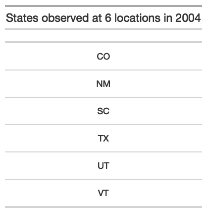
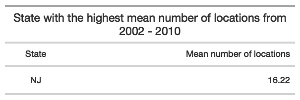

PUBH 7462 Homework 2
================
Kristin Elgersma
2/10/22

## Problem 3. BRFSS SMART 2002-2010

``` r
# Read data
brfss <- read_csv("./data/brfss_smart_2010.csv")
```

### 3.1 Data Exploration & Cleaning

``` r
# clean variable names
brfss <- janitor::clean_names(brfss)

# clean data
brfss.clean <- brfss %>%
  filter(topic == "Overall Health") %>% # select overall health topic
  separate(locationdesc, c(NA, "county")) %>% # create county variable
  mutate(locationabbr = factor(locationabbr), 
         state = fct_recode(locationabbr)) %>% # rename locationabbr to state
  dplyr::select(year, state, county, response, sample_size, data_value) # retain desired columns

# Make other categorical variables factors
brfss.clean$year <- as.factor(brfss.clean$year)
brfss.clean$county <- as.factor(brfss.clean$county)
brfss.clean$response <- as.factor(brfss.clean$response)
```

### 3.2 Data Description

1.  **Number of observations:** 10625
2.  **Number of variables:** 6
3.  **Definition of a case:** Each case represents a group of
    individuals from a county who provided the same answer to an overall
    health question in the same year.
4.  **Variable names and definitions**:

-   year: Year of observation
-   state: State of observation
-   county: County of observation
-   response: Response to question: “How is your general health?” Answer
    choices include “Excellent,” Very good,” Good,” “Fair,” and “Poor”
-   sample_size: Number of individuals that chose the given response
    option
-   data_value: Proportion of individuals those chose the given response
    option in a given county, in a given year.

### 3.3 Data Science

#### 3.3.1 In the year 2004, which states were observed at 6 locations?

``` r
df <- brfss.clean %>%
  filter(year == "2004") %>% # choose only 2004 observations
  group_by(state) %>%
  distinct(county) %>% # list the counties in which observations occurred
  summarise(no_rows = length(state)) %>% # count locations in each state
  filter(no_rows == 6) # select only those with 6 locations

# create table
table1 <- df %>%
  gt() %>%
  tab_header("States observed at 6 locations in 2004") %>%
  cols_label(state = " ") %>%
  cols_hide(no_rows) %>%
  tab_options(
    container.width = pct(30),
    container.height = pct(30),
    table.font.size = "xx-small"
  )

# save table image
gtsave(table1, "table1.png")
```



#### 3.3.2 Make a “spaghetti plot” that shows the number of observed locations in each state from 2002 to 2010.

``` r
df <- brfss.clean %>%
  group_by(year, state) %>%
  distinct(county) %>% # list the counties in which observations occurred
  summarise(no_rows = length(state)) %>% # count locations in each state
  complete(state) # make sure that no states are completely missing a year

# change nas for states with no observation that year to 0 for better plotting and summary statistics
df$no_rows[is.na(df$no_rows)] <- 0

# create a column with mean # of locations by state for plotting
df <- df %>%
  group_by(state) %>%
  mutate(mean_loc = mean(no_rows))

# spaghetti plot
df %>%
  ggplot(aes(year, no_rows)) +
  geom_line(aes(group = state, color = fct_reorder(state, mean_loc, .desc = TRUE)), # order states from highest to lowest mean # of locations
    size = 1, alpha = 0.5
  ) +
  theme_minimal() +
  labs(
    x = "Year",
    y = "Number of locations",
    title = "Spaghetti plot showing number of observed locations 
       in each state from 2002 - 2010",
    caption = "*States listed from highest to lowest mean number of locations"
  ) +
  scale_color_viridis_d(name = "State*") +
  theme(
    legend.position = "bottom",
    legend.key.height = unit(0.3, "cm")
  )
```


Which state has the highest mean number of locations over this period?

``` r
df2 <- df %>%
  group_by(state) %>%
  summarise(mean = mean(no_rows)) %>% # get mean number of locations by state
  slice_max(mean, n = 1) # select the location with the highest mean

# create the table showing the highest mean number of locations
table2 <- df2 %>%
  gt() %>%
  fmt_number(
    columns = mean,
    decimals = 2 # only 2 decimal points
  ) %>%
  tab_header("State with the highest mean number of locations
             from 2002 - 2010") %>%
  cols_label(
    state = "State",
    mean = "Mean number of locations"
  ) %>%
  tab_options(
    container.width = pct(30),
    container.height = pct(30),
    table.font.size = "xx-small"
  )

# save table image
gtsave(table2, "table2.png")
```



#### 3.3.3 Make a table showing, for the years 2002, 2006, and 2010, the mean and standard deviation of sample size and proportion of Excellent, Good, and Poor responses across locations in MN.

``` r
df <- brfss.clean %>%
  filter(year == "2002" | year == "2006" | year == "2010") %>%
  filter(state == "MN") %>%
  filter(response == "Excellent" | response == "Good" | response == "Poor") %>%
  group_by(year, response) %>%
  summarise(
    across(
      contains(c("sample_size", "data_value")),
      list(mean = mean, sd = sd),
      na.rm = TRUE,
      .names = "{.col}_{.fn}"
    )
  ) %>%
  ungroup() %>%
  group_by(year)

# Create table
table3 <- df %>%
  gt() %>%
  fmt_number(
    columns = c(3:6),
    decimals = 2 # only 2 decimals
  ) %>%
  tab_header("Mean and standard deviation of sample size and proportion of respondents 
             whose health was excellent, good, or poor in Minnesota 
             in 2002, 2006, and 2010") %>%
  cols_label(
    response = " ",
    sample_size_mean = "Sample size mean",
    sample_size_sd = "Sample size SD",
    data_value_mean = "Proportion mean",
    data_value_sd = "Proportion SD"
  )

# save table image
gtsave(table3, "table3.png")
```


The mean number of respondents went up consistently in all categories
from 2002 - 2010. However, the proportion of respondents reporting
excellent, good, or poor health in each year stayed approximately the
same over time.

#### 3.3.4 Plot of previous data

``` r
df2 <- df %>%
  pivot_longer(
    cols = c(sample_size_mean, sample_size_sd, data_value_mean, data_value_sd),
    names_to = "measure",
    values_to = "value"
  ) %>%
  mutate(
    measure = fct_recode(measure,
      "Mean sample size" = "sample_size_mean",
      "Sample size standard deviation" = "sample_size_sd",
      "Mean proportion" = "data_value_mean",
      "Proportion standard deviation" = "data_value_sd"
    ),
    measure = fct_relevel(measure, c(
      "Mean sample size", "Sample size standard deviation",
      "Mean proportion", "Proportion standard deviation"
    ))
  )


df2 %>%
  ggplot(aes(x = year, y = value, fill = response)) +
  geom_col(position = "dodge") +
  theme_minimal() +
  labs(
    title = "Mean and standard deviation of sample size and proportion of respondents \n whose health was excellent, good, or poor in Minnesota \n in 2002, 2006, and 2010",
    x = "Year",
    y = " "
  ) +
  scale_fill_viridis_d(name = "General health") +
  theme(legend.position = "bottom") +
  theme(plot.title = element_text(hjust = 0.5)) +
  facet_wrap(~measure, scales = "free")
```


